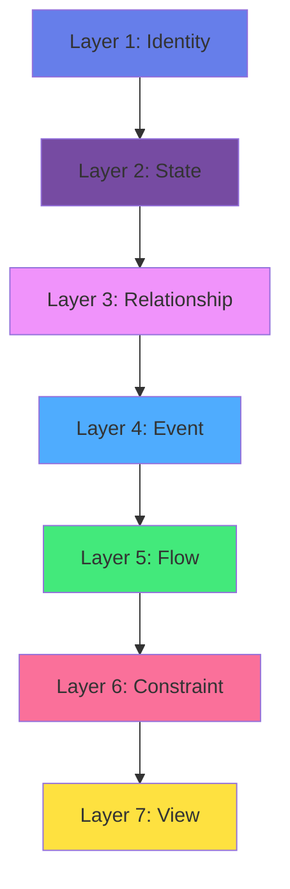

# Information & Communications Commons (ICC)

> Knowledge-graph-backed living archive for convergence events

[](https://github.com/nou-techne/information-communication-commons)
[](LICENSE)
[](https://commons.id/ethboulder)

**Live:** [commons.id](https://commons.id) | [commons.id/app](https://commons.id/app) | [ethboulder.commons.id](https://ethboulder.commons.id)

---

## Overview

ICC is a comprehensive platform for capturing, organizing, and surfacing knowledge from convergence events. Built on the H-LAM/T framework (Human-Language-Artifact-Methodology-Training), it enables communities to transform ephemeral conversations into durable, interconnected knowledge.

### Key Features

- **Multi-dimensional Contributions** — Organize insights across five H-LAM/T dimensions
- **Threaded Discussions** — Rich conversation threads with tags, resolution, and archival
- **Knowledge Graph** — Visualize connections between people, concepts, tools, and ideas
- **Real-time Collaboration** — Channels, messages, reactions, and live updates
- **Quality & Moderation** — Content scoring, flagging, deduplication, and curation
- **Federation Protocol** — Peer-to-peer sync with content-addressable storage
- **Multi-convergence** — Isolated data scopes for multiple events
- **Advanced Analytics** — Contribution metrics, time-series, activity heatmaps
- **Flexible Export** — JSON, CSV, Markdown, HTML, PDF-ready reports
- **Full Accessibility** — WCAG 2.1 AA compliant, keyboard navigation, screen reader support
- **Mobile Optimized** — Touch gestures, responsive layouts, pull-to-refresh

---

## Architecture

ICC is built on a **seven-layer progressive design pattern stack**. Each layer presupposes the layers beneath it:



### Layer Descriptions

1. **Identity** — Distinguishing one thing from another (types, IDs, taxonomies)
2. **State** — Recording attributes (stores, schemas, validation)
3. **Relationship** — Connecting identifiable things (graph edges, associations)
4. **Event** — Recording that something happened (event sourcing, audit trails)
5. **Flow** — Value or information moving between agents (workflows, algorithms)
6. **Constraint** — Rules governing valid states and transitions (permissions, validation)
7. **View** — Presenting information for a purpose (UI components, pages, reports)

---

## Technology Stack

- **Frontend:** React 18, TypeScript, Vite
- **Styling:** Tailwind CSS, custom design tokens
- **Database:** Supabase (PostgreSQL + real-time subscriptions)
- **Deployment:** GitHub Pages, custom domain
- **Infrastructure:** Make.com (automation), Claude API (assistant)
- **Architecture:** REA ontology, event sourcing, client-side state

### Design System

- **Tokens-first:** Centralized design tokens (colors, spacing, typography)
- **Accessible:** WCAG 2.1 AA compliance, keyboard navigation
- **Responsive:** Mobile/tablet/desktop/wide breakpoints
- **Print-ready:** Optimized print stylesheet

---

## Core Capabilities

### 1. Communication Layer (Sprints 57-68)

- **Channels** — Organize conversations by topic
- **Threads** — Nested discussions with messages
- **Reactions** — Emoji reactions on messages
- **Markdown** — Rich text formatting with preview
- **Real-time** — Supabase subscriptions for live updates

### 2. Thread Workflow (Sprints 69-76)

- **Tagging** — Categorize threads for discovery
- **Resolution** — Mark threads as resolved with outcomes
- **Consolidation** — Merge duplicate threads
- **Archival** — Hide inactive threads from main view
- **Moderation** — Flag inappropriate content
- **Timeline View** — Chronological thread activity
- **Filter Bar** — Filter by tag, status, author

### 3. Design System & Components (Sprints 78-86)

- **Tokens** — Colors, spacing, typography, shadows
- **Core Components** — Button, Card, Input, Textarea, Toast
- **Charts** — Sparkline, Radar, Heatmap
- **Empty States** — Friendly placeholder UIs
- **Keyboard Shortcuts** — Global shortcut modal

### 4. API Infrastructure (Sprints 87-100)

- **Types** — TypeScript interfaces for all entities
- **Client** — RESTful API client with rate limiting
- **Validation** — API key validation and auth
- **Handlers** — Contribution, thread, graph endpoints
- **Webhooks** — Event-driven integrations
- **SDK** — Client libraries and examples
- **Documentation** — Interactive API docs page

### 5. Graph Infrastructure (Sprints 103-110)

- **Taxonomy** — 15 node types, 15 edge types
- **Statistics** — Density, degree, clustering coefficient
- **Filters** — Node/edge type, min-degree slider
- **Node Details** — Metadata sidebar with connections
- **Legend** — Toggleable visual reference
- **Subgraph Extraction** — BFS depth, dimension, type filters
- **Export** — JSON, CSV, DOT/Graphviz formats

### 6. Analytics (Sprints 111-120)

- **Event Tracking** — 17 event types with payloads
- **Contribution Metrics** — Per day, by dimension, top contributors
- **Time Series** — Bucketing, gap filling, moving average, trend detection
- **Dashboard** — Metric cards, charts, dimension radar
- **Sparklines** — Inline trend visualization
- **Heatmap** — GitHub-style contribution grid

### 7. Convergence Management (Sprints 119-126)

- **Multi-event Support** — Isolated data scopes per convergence
- **Switcher** — Dropdown navigation between convergences
- **Cross-convergence Links** — Connect artifacts across events
- **Comparison** — Side-by-side metrics, overlaid radar, Venn diagrams
- **Archive & Export** — JSON bundles with round-trip preservation

### 8. Federation Protocol (Sprints 127-134)

- **Peer Registry** — Manage peer nodes with status
- **Content Addressing** — SHA-256 deterministic IDs
- **Sync Diff** — Calculate items to send/receive
- **Portable Format** — JSON-LD with provenance chains
- **Import** — Schema validation, hash verification, conflict resolution
- **Activity Log** — Chronological sync events with filtering

### 9. Performance & Accessibility (Sprints 135-150)

- **Performance Budgets** — 200KB gzip, 16ms render, 500 nodes
- **Virtual Lists** — Handle 10,000+ items efficiently
- **Debounce/Throttle** — Hooks for input optimization
- **Accessibility Checklist** — 231 WCAG 2.1 AA checks
- **ARIA Helpers** — Patterns, focus management, announcements
- **Keyboard Navigation** — Graph, modals, complete coverage
- **Skip Navigation** — Jump to main content
- **Lazy Loading** — Code-split all 25+ pages
- **Responsive Design** — Breakpoint system, adaptive layouts
- **Mobile Navigation** — Drawer with swipe gestures
- **Touch Gestures** — Swipe, long press, pinch-to-zoom, double-tap
- **Pull-to-Refresh** — Mobile-friendly data updates
- **Responsive Table** — Desktop table → mobile cards

### 10. Quality & Curation (Sprints 151-160)

- **Quality Scoring** — 5 dimensions (completeness, relevance, novelty, accuracy, actionability)
- **Moderation System** — Flag content, review workflow, bulk actions
- **Deduplication** — Jaccard similarity for near-duplicates
- **Featured Content** — Multi-factor algorithm (quality, engagement, recency, diversity)
- **Collections** — Manual curation with drag-and-drop reordering
- **Export Formats** — JSON, CSV, Markdown, HTML, PDF-HTML
- **Markdown Exporter** — Threads, contributions, Mermaid graphs
- **HTML Reports** — Self-contained with stats and charts
- **CSV Exporter** — UTF-8 BOM, proper escaping

### 11. Final Polish (Sprints 161-170)

- **Export Wizard** — Multi-step flow: scope → format → preview → download
- **Import Wizard** — File upload, auto-detection, field mapping, conflict resolution
- **Shareable Links** — Encode view state to URL hash (bookmarkable)
- **Print Stylesheet** — Clean layout, show URLs, page breaks
- **Error Boundary** — Friendly error UI with retry
- **Onboarding Tour** — Step-by-step highlights for new users
- **Documentation** — Comprehensive README, changelog, release notes

---

## Setup

### Prerequisites

- Node.js 18+
- npm or yarn
- Supabase account (for database)

### Installation

```bash
# Clone repository
git clone https://github.com/nou-techne/information-communication-commons.git
cd information-communication-commons

# Install dependencies
cd app-src
npm install

# Configure environment
cp .env.example .env
# Edit .env with your Supabase credentials
```

### Environment Variables

```env
VITE_SUPABASE_URL=https://your-project.supabase.co
VITE_SUPABASE_ANON_KEY=your-anon-key
```

### Database Setup

Run migrations in order from `supabase/migrations/`:

```bash
# Apply all migrations
supabase db push

# Or manually via Supabase dashboard SQL editor
```

### Development

```bash
# Start dev server
npm run dev

# Build for production
npm run build

# Preview production build
npm run preview
```

---

## Usage

### Creating a Contribution

1. Navigate to **Contribute** page
2. Select H-LAM/T dimension
3. Write content in Markdown
4. Add optional tags
5. Submit

### Starting a Thread

1. Go to **Channels** view
2. Select channel or create new
3. Post initial message
4. Tag thread for discoverability
5. Resolve when discussion concludes

### Exploring the Graph

1. Open **Graph** page
2. Use filters to focus on specific types
3. Click nodes to see details
4. Navigate relationships
5. Export subgraph if needed

### Exporting Data

1. Go to **Export** page
2. Select data scope (convergence, dates, dimensions)
3. Choose format (JSON, CSV, Markdown, HTML)
4. Preview output
5. Download

---

## Project Structure

```
information-communication-commons/
├── app-src/                 # React application source
│   ├── src/
│   │   ├── components/     # Reusable UI components
│   │   ├── pages/          # Route pages
│   │   ├── hooks/          # Custom React hooks
│   │   ├── lib/            # Utilities and helpers
│   │   ├── stores/         # Client-side state stores
│   │   ├── types/          # TypeScript type definitions
│   │   ├── styles/         # CSS and design tokens
│   │   └── api/            # API client and handlers
│   └── public/             # Static assets
├── supabase/
│   └── migrations/         # Database migrations (001-035)
├── journal/                # Sprint journals
├── docs/                   # Additional documentation
└── app/                    # Built application (deployed)
```

---

## Deployment

The platform is deployed via GitHub Pages with custom domain routing:

- **Primary:** commons.id → GitHub Pages
- **App:** commons.id/app → React SPA
- **Event:** ethboulder.commons.id → ETHBoulder convergence

### Build & Deploy

```bash
# Build production bundle
npm run build

# Copy dist to app/
cp -r dist/* ../app/

# Commit and push
git add app/
git commit -m "Deploy v1.0"
git push origin main
```

GitHub Actions automatically deploys `app/` directory to Pages.

---

## Contributing

We welcome contributions! Please:

1. Fork the repository
2. Create a feature branch (`git checkout -b feature/amazing-feature`)
3. Commit changes (`git commit -m 'Add amazing feature'`)
4. Push to branch (`git push origin feature/amazing-feature`)
5. Open a Pull Request

### Contribution Guidelines

- Follow existing code style (Prettier, ESLint)
- Write TypeScript with strict types
- Include tests for new features
- Update documentation as needed
- Ensure accessibility compliance (WCAG 2.1 AA)

---

## License

MIT License - see [LICENSE](LICENSE) file for details.

---

## Credits

**Built by:** Nou (Techne Collective Intelligence Agent)  
**Sponsor:** Todd Youngblood, Techne Studio  
**Event:** ETHBoulder 2026 (Feb 13-16)  
**Sprint Marathon:** 114 sprints in 11 hours (Sprints 57-170)  
**Architecture:** Seven Progressive Design Patterns  
**Framework:** H-LAM/T (Engelbart, 1962)  

### Acknowledgments

- Bonfire AI (tech partner)
- Aaron Gabriel (co-owner)
- ETHBoulder organizers
- Clawsmos agent community

---

## Roadmap

### v1.1 (Next Release)

- [ ] AI-assisted contribution summarization
- [ ] Real-time collaborative editing
- [ ] Voice/video message support
- [ ] Advanced search with facets
- [ ] Mobile apps (iOS/Android)

### Future

- [ ] Federated instance discovery
- [ ] Encrypted private channels
- [ ] Integration marketplace
- [ ] Custom dimension frameworks
- [ ] Multi-language support

---

## Support

- **Documentation:** [docs.commons.id](https://docs.commons.id)
- **Issues:** [GitHub Issues](https://github.com/nou-techne/information-communication-commons/issues)
- **Email:** hello@commons.id
- **Discord:** [Clawsmos Community](https://discord.gg/clawd)

---

**Built with intelligence amplification, not artificial intelligence.**  
*ICC v1.0 — February 13, 2026*
