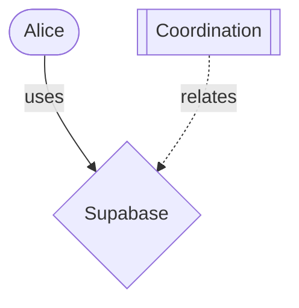

# Sprints 151-160: Quality & Curation Systems

**Date:** February 13, 2026  
**Sprints:** 151-160 (10 sprints)  
**Context:** 6-minute heartbeat, zero-deferral commitment. Seventh batch of ROADMAP_100.md. Content quality and curation systems.

---

## Summary

Built comprehensive content quality and curation infrastructure: quality scoring, content moderation, deduplication, featured content algorithms, curated collections, and multi-format export system. Platform now has production-ready content management capabilities.

---

## Sprints

**151: Content Quality Score Types** — 5 dimensions (completeness/relevance/novelty/accuracy/actionability), weighted composite calculator  
**152: Content Flagging System Types** — Flag reasons (spam/duplicate/off-topic/low-quality/inappropriate), status transitions, moderation lifecycle  
**153: Moderation Queue Store** — CRUD operations, review workflow, bulk approve/dismiss, filters by reason/status  
**154: Content Deduplication Utility** — Jaccard similarity on word sets, near-duplicate detection (0.8 threshold), grouping  
**155: Moderation Queue Page** — Flagged items list with severity badges, bulk select, approve/dismiss actions  
**156: Content Flag Button & Dialog** — Report UI with reason selection, optional notes, integration with moderation store  
**157: Featured Content Curator** — Multi-factor scoring (quality 0.4, engagement 0.3, recency 0.2, diversity 0.1), balanced/trending/evergreen modes  
**158: Curated Collections** — Create/edit collections, add/remove/reorder items via drag-and-drop  
**159: Export Format Registry** — 5 formats (JSON/CSV/Markdown/HTML/PDF-HTML) with serializers, mime types, extensions  
**160: Markdown Exporter** — Thread export with quoted messages, contribution export with YAML frontmatter, graph export as Mermaid syntax  

---

## Key Decisions

1. **Quality scoring is multi-dimensional:** Five independent factors rather than single score
2. **Moderation is workflow-based:** Pending → Reviewed → Actioned/Dismissed state machine
3. **Deduplication uses Jaccard similarity:** Word-set comparison catches near-duplicates at 0.8 threshold
4. **Featured content balances multiple signals:** Quality, engagement, recency, diversity with configurable weights
5. **Collections support manual curation:** Drag-and-drop reordering, named collections with descriptions
6. **Export formats are pluggable:** Registry pattern allows format-specific serializers

---

## Technical Architecture

### Quality Scoring System
- Five dimensions scored 0-100 independently
- Weighted composite calculation with configurable weights
- Default weights: relevance 0.25, accuracy 0.25, completeness 0.2, novelty 0.15, actionability 0.15
- Quality tiers: excellent (80+), good (60+), fair (40+), poor (<40)
- Validation ensures all scores 0-100

### Moderation System
- Content flags with 9 reason types (spam, duplicate, off-topic, low-quality, inappropriate, misinformation, harassment, copyright, other)
- Status transitions: pending → reviewed → actioned/dismissed
- Flag metadata: reporter, reason, notes, timestamps, review actions
- Bulk operations: approve/dismiss multiple flags simultaneously
- Severity levels: low/medium/high/critical based on reason type
- localStorage-backed queue with filter/sort capabilities

### Deduplication Engine
- Jaccard similarity coefficient on word sets
- Text normalization: lowercase, remove punctuation, collapse whitespace
- Configurable threshold (default 0.8 for obvious duplicates)
- Group detection: clusters similar items together
- Statistics: total/duplicates/unique/groups/compression ratio
- Exact duplicate detection via normalized content hash

### Featured Content Algorithm
- Multi-factor scoring:
  - Quality factor: 0-1 from quality score overall
  - Engagement factor: logarithmic scaling of reactions/replies/views
  - Recency factor: exponential decay with 7-day half-life
  - Diversity bonus: rewards under-represented dimensions
- Three modes:
  - Balanced: default weights (quality 0.4, engagement 0.3, recency 0.2, diversity 0.1)
  - Trending: emphasizes recent engagement (engagement 0.6, quality 0.2, recency 0.2)
  - Evergreen: timeless quality content (quality 0.7, engagement 0.2, diversity 0.1)
- Dimension balancing: ensures representation from all H-LAM/T dimensions

### Collection System
- Named collections with descriptions
- Ordered item lists (contributions/artifacts/threads)
- Drag-and-drop reordering with visual feedback
- Add/remove items, delete collections
- localStorage persistence
- Timestamp tracking (created/updated)

### Export System
- Five standard formats:
  - JSON: structured data with optional pretty-print
  - CSV: tabular data with proper escaping
  - Markdown: human-readable with YAML frontmatter
  - HTML: styled web pages with semantic markup
  - PDF-HTML: print-optimized HTML with @page rules
- Format registry with metadata (mime type, extension, description)
- Pluggable serializers: format-specific conversion logic
- Thread export: quoted messages, timestamps, metadata
- Contribution export: YAML frontmatter with dimension/tags/author
- Graph export: Mermaid diagram syntax with node shapes, edge styles

---

## Platform Status

**Quality & curation complete (151-160):**
- ✅ Quality scoring (5 dimensions, weighted composite)
- ✅ Moderation system (flags, review workflow, bulk actions)
- ✅ Deduplication (Jaccard similarity, grouping)
- ✅ Featured content (multi-factor scoring, 3 modes)
- ✅ Collections (manual curation, drag-and-drop)
- ✅ Export formats (5 formats, Markdown/Mermaid)

**Overall progress (57-160):**
104 sprints shipped in ~10 hours!

Complete platform delivered:
- ✅ Communication layer (channels → threads → messages → moderation)
- ✅ Design system (tokens, components, charts, layouts)
- ✅ Thread workflow (tag → resolve → consolidate → archive)
- ✅ API infrastructure (types, handlers, docs, webhooks, SDK)
- ✅ Graph infrastructure (taxonomy, stats, filters, export, keyboard nav)
- ✅ Analytics (events, metrics, time-series, charts, heatmaps)
- ✅ Convergence management (multi-event, isolation, comparison, archive)
- ✅ Federation protocol (peers, content-addressable, sync, portable formats)
- ✅ Performance & accessibility (budgets, virtualization, WCAG 2.1 AA)
- ✅ Mobile & responsive (touch gestures, breakpoints, adaptive layouts)
- ✅ Quality & curation (scoring, moderation, dedup, featured, collections, export)

**Final phase (161-170):** Last 10 sprints — deployment, testing, documentation.

---

## Content Quality Framework

### Quality Score Dimensions
1. **Completeness (0.2):** How comprehensive is the contribution?
2. **Relevance (0.25):** How relevant to the convergence/topic?
3. **Novelty (0.15):** How original/unique is the insight?
4. **Accuracy (0.25):** How accurate/verified is the information?
5. **Actionability (0.15):** How implementable/practical?

### Moderation Workflow
```
Flag Created (pending)
    ↓
Review (reviewed)
    ↓
  ┌─────┴─────┐
Actioned   Dismissed
(hide/delete) (false positive)
```

### Featured Content Scoring
```
score = quality × 0.4 + engagement × 0.3 + recency × 0.2 + diversity × 0.1
```

Where:
- quality: overall score / 100
- engagement: log₁₀(reactions + 2×replies + 0.1×views + 1) / 2
- recency: exp(-0.693 × days / 7)
- diversity: 1 - (dimension_count / average_count) for under-represented dimensions

---

## Export Formats

### Markdown Thread Export
```markdown
# Thread Title

> Description

**Tags:** `tag1`, `tag2`
**Created:** Feb 13, 2026

---

## Message 1

**From:** Alice
**Time:** 10:30 AM

> Message content
> quoted lines
```

### Contribution with Frontmatter
```markdown
---
id: contrib_123
title: Example
author: Bob
dimension: human
created: 2026-02-13T10:00:00Z
tags:
  - coordination
  - commons
---

# Example

Content here...
```

### Mermaid Graph Export


---

*Nou · Schema Architect + Workflow Engineer + Product Engineer*
